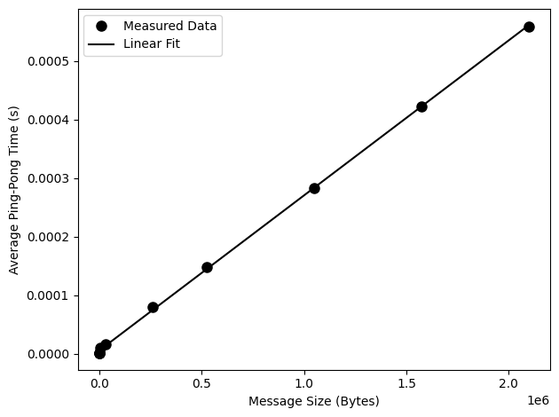

## Code Instructions


## Results and Analysis – Week 4
### Part 1:
#### Step 1:
For `comm_test_mpi.c`, as the number of MPI processes increases, the program continues to function correctly, but the order that the messages are printed becomes less predictable. When running the program with 4, 8, 12 and 16 processors, each 
client rank successfully sends its value to the root (rank 0) and the root receives one message from every other process. This shows that the communication pattern is working as intended and scales well with the number of 
processors.

However, the order in which the “Sent” messages appear varies between runs and becomes more mixed as more processors are used. This happens because MPI processes run at the same time and are scheduled independently by the 
system. Therefore, there is no definite ordering of when each process executes its print statements. In contrast, rank 0 is seen to display its “Received” messages in ascending rank order which shows that it is receiving 
messages in an ordered loop. Overall, these experiments show the random and asynchronous nature of parallel execution in MPI, especially as the processor count increases.

#### Step 2:
In the updated version of `comm_test_mpi.c`, the original main function has been broken down into smaller, easier-to-read functions. The root_task function handles receiving messages for the root process (rank 0), while 
client_task handles sending messages for the other processes. The check_task function decides whether a process should act as a root or client, and error_check prints a warning if there are fewer than two processes. 
Prototypes are declared at the top and main just initialises MPI, sets up variables, calls check_task and finalises MPI. This does the same as the original code but makes it cleaner and easier to understand. Commit history 
of `comm_test_mpi.c` can be seen using the link: "https://github.com/abelraj20/HPQC/commits/main/week4/src/comm_test_mpi.c" for more details.

#### Step 3:
The program was modified to `comm_vars_mpi.c` to use the four variants of the send operation defined in the Message Passing Interface - `MPI_Ssend()`, `MPI_Bsend()`, `MPI_Rsend()` and `MPI_Isend()`. The overall 
communication pattern remained the same but some of them behaved differently. With `MPI_Ssend()`, communication was very reliable because the call is synchronous and blocks until the matching receive is posted by the root 
process. This resulted in consistent execution with no runtime issues. `MPI_Bsend()` also worked correctly once buffering was properly configured. `MPI_Rsend()` was more situational since it assumes that a matching receive 
has already been posted. Its correctness depended on timing and in some runs, there would be an outcome error if the recieve command hadn't been posted. `MPI_Isend()` was the only one that produced an error when trying to 
output binary files ("error: too few arguments to function ‘MPI_Isend’". This is because it requires more arguments such as `MPI_Request` and `MPI_Wait` as it starts the send asynchronously. Overall, for reliability and 
reproducibility in this communication test, `MPI_Ssend()` was the most suitable choice because it has clear synchronisation between sender and receiver and reduces the timing-dependant behaviour.

#### Step 4:
From table 1, it is seen that the send and receive times for all four MPI variants are extremely short, generally in the microsecond range. Ssend shows the most variability across runs, with times ranging from around 
0.000023 s to 0.000243 s, whereas Bsend is slightly more consistent, typically between 0.000002 s and 0.000022 s. Rsend and Isend consistently register the fastest times, often around 0.000001–0.000011 s but their behavior 
depends on the receiver being ready (Rsend) or on proper waiting for the non-blocking request (Isend).

<div align="center">
    
Table 1: Runtime measurements and variability for the four MPI send variants (Ssend, Bsend, Rsend, Isend) over five runs using 4 MPI processes.
| Rank | Communication Type | Min Time (s) | Max Time (s) | Avg Time (s) |
|------|------------------|-------------|-------------|-------------|
| 1    | Ssend            | 0.000023    | 0.000049    | 0.000033    |
| 1    | Bsend            | 0.000003    | 0.000020    | 0.000011    |
| 1    | Rsend            | 0.000001    | 0.000001    | 0.000001    |
| 1    | Isend            | 0.000001    | 0.000011    | 0.000006    |
| 2    | Ssend            | 0.000026    | 0.000156    | 0.000065    |
| 2    | Bsend            | 0.000003    | 0.000022    | 0.000010    |
| 2    | Rsend            | 0.000001    | 0.000002    | 0.000002    |
| 2    | Isend            | 0.000001    | 0.000010    | 0.000006    |
| 3    | Ssend            | 0.000044    | 0.000243    | 0.000123    |
| 3    | Bsend            | 0.000002    | 0.000023    | 0.000010    |
| 3    | Rsend            | 0.000001    | 0.000002    | 0.000002    |
| 3    | Isend            | 0.000001    | 0.000004    | 0.000003    |
| 0    | Recv (from 1-3)  | 0.000002    | 0.000134    | 0.000065    |


</div>

The receive times at rank 0 also fluctuate, from 0.000002 s to 0.000134 s, reflecting the asynchronous nature of the sends and the scheduling of the processes. Overall, while Rsend and Isend are fastest, Ssend and Bsend 
are more reliable and predictable for ensuring correct delivery. This is important when scaling to more processes. Table 1 clearly shows the differences between execution speeds of the four MPI send variants and their 
respective inconsistencies.

### Part 2:
#### Step 1:
`pingpong.c` program created in src/ folder.

#### Step 2:
Table 2 shows the timing results of a ping-pong MPI program executed with two processes for increasing numbers of pings. The program works by initialising a counter at the root process. The root sends the counter to the 
client process using `MPI_Send` (ping), the client receives it, increments it by one and sends it back to the root (pong) using `MPI_Send`. This process repeats until the counter reaches the number of pings specified in 
the argument. The program measures the time using MPI’s internal timing functions (`MPI_Wtime`) to record the start and end times around each complete ping-pong loop.

<div align="center">

Table 2: `pingpong.c` Timing Results for Increasing Numbers of Pings
| No. of Pings | Elapsed Time (s) | Avg. Time per Ping-Pong (s)|
|--------------|------------------|----------------------------|
| 10¹          | 0.000037         | 0.000004                   |
| 10²          | 0.000254         | 0.000003                   |
| 10³          | 0.000936         | 0.000001                   |
| 10⁴          | 0.007543         | 0.000001                   |
| 10⁵          | 0.063761         | 0.000001                   |
| 10⁶          | 0.651149         | 0.000001                   |

</div>

From Table 2, it can be observed that as the number of pings increases, the total elapsed time grows roughly linearly from 0.000037 s for 10 pings to 0.651149 s for 1 million pings. The average time per ping-pong 
quickly converges to approximately 0.000001 s (1 µs) for larger numbers of pings. For small numbers of pings (10–100), there is some variability in timing due to measurement precision. As the number of iterations 
increases to 10³ and above, this variance becomes negligible, indicating that the measured communication time per ping-pong converges to a stable and reproducible value. These results demonstrate that `MPI_Send` and 
`MPI_Recv` provide reliable and predictable performance for repeated point-to-point communications and the timing converges as the number of ping-pong iterations become 1000 and above.

#### Step 3:
For this experiment, the original `pingpong.c` program was extended to handle arrays of varying sizes using dynamic memory allocation (malloc). The program, `pingpong_2.c` takes two arguments: the number of pings and 
the size of the message in bytes. Each ping sends the array from the root process to the client process and back. The first element of the array was used as a counter to track the number of completed pings. Timing was 
measured using `MPI_Wtime()` at the root process and the average time per ping-pong was calculated by dividing the total elapsed time by the number of pings. This approach allowed the experiment to measure how the 
message size affects MPI communication latency and bandwidth.

<div align="center">
    
Table 3: `pingpong_2.c` Timing Results for 10⁴ Pings at Increasing Message Sizes
| Message size (Bytes) | Elapsed time (s) | Avg. Time per Ping-Pong (s) |
|----------------------|------------------|----------------------------|
| 8                    | 0.008566         | 0.000001                   |
| 64                   | 0.011701         | 0.000001                   |
| 512                  | 0.013078         | 0.000001                   |
| 4096                 | 0.106751         | 0.000011                   |
| 32768                | 0.169061         | 0.000017                   |
| 262144               | 0.798168         | 0.000080                   |
| 524288               | 1.494146         | 0.000149                   |
| 1048576              | 2.827135         | 0.000283                   |
| 1572864              | 4.229262         | 0.000423                   |
| 2097152              | 5.585534         | 0.000559                   |

</div>

The results in Table 3 show a clear trend for very small messages (8–512 bytes), where the average ping-pong time remains constant at around 1 μs which is likely due to the latency. As the message size 
increases, the time per ping-pong grows linearly. For example, sending a 4 KiB (4095 Bytes) array takes around 11 μs per iteration, while sending a 2 MiB (2097152 Bytes) array requires approximately 559 μs. This 
increase reflects the additional time required to transmit larger amounts of data over the MPI channel, where bandwidth becomes the limiting factor rather than latency.

<p align="center">

</p>

<div align="center">
    
Figure 1: Average ping-pong time versus message size for `pingpong_2.c`. Filled circles are the measured data for 10⁴ pings and the black line is a linear fit used to estimate latency and bandwidth.

</div>

From Figure 1, using a linear fit to the data, the intercept (c) gives the latency of the system and the inverse of the slope (m) gives the bandwidth. Using `np.polyfit` with a degree of 1 (linear) and the array of 
message sizes and average times acting as arguments, m and c is retrieved. This gives a latency of 5.72 μs (2.86 μs for one-way) and a bandwidth of 3775.98 MB/s. As a result, small messages are dominated by latency and 
as message size grows, the communication time is limited by the available bandwidth. Overall, this experiment shows the importance of both latency and bandwidth in MPI communication and provides a clear quantitative 
method for evaluating performance.

### Part 3:
#### Step 1:
As seen in Table 4, for small vector sizes (10^1–10^3), the measured runtimes are all on the order of 10^-4 seconds. The differences between methods are inconsistent and varied 
depending on the run. For example, for Broadcast and DIY, their execution times for vector sizes of 10^3 are seen to be lower than their execution times for vector sizes of 10^1. 
This shows that fixed communication overhead and timing noise performance at small scales.

As the vector size increases, clearer trends emerge. At 10^5 elements, Scatter (0.001585 s) and DIY (0.001303 s) are significantly faster than Broadcast (0.002121 s). This gap widens only 
at 10^6 where Broadcast takes ~0.017 s compared to ~0.011 s for Scatter and ~0.014 s for DIY. At the largest tested size, 10^8, Scatter is the fastest at ~0.747 s, followed closely by DIY 
at ~0.795 s, while Broadcast is slowest at 1.106 s. The Broadcast time is seen to be ~48% slower than Scatter at a vector size of 10^8.

<div align="center">

Table 4. Benchmark comparison of MPI communication strategies for parallel vector summation using 4 processes. Execution times are the total parallel runtimes.
| Vector Size | Scatter (s) | Broadcast (s) | DIY (Send/Recv) (s) |
|-------------|-------------|---------------|---------------------|
| 10¹         | 0.000210    | 0.000190      | 0.000257            |
| 10²         | 0.000166    | 0.000088      | 0.000108            |
| 10³         | 0.000231    | 0.000126      | 0.000160            |
| 10⁴         | 0.000342    | 0.000428      | 0.000242            |
| 10⁵         | 0.001585    | 0.002121      | 0.001303            |
| 10⁶         | 0.010629    | 0.016813      | 0.013901            |
| 10⁷         | 0.080731    | 0.113574      | 0.086947            |
| 10⁸         | 0.746653    | 1.105556      | 0.795407            |

</div>

These results show that for large vectors, methods that distribute only the required chunks (Scatter and DIY) scale better than broadcasting the entire array to all processes which 
was what I had predicted. Scatter performs best overall at large sizes, suggesting that MPI’s optimised collective communication provides more efficient data distribution than manual 
point-to-point messaging.

#### Step 2
From Table 5, it is clear that the performance of MPI communication methods depends heavily on the size of the vector. For small vectors (10¹–10³), all three methods - Send/Recv, 
Gather, and Reduce perform almost identically because the communication overhead overshadows the runtime. As the vector size increases (10⁴–10⁵), Send/Recv and Gather start to take 
noticeably longer, while Reduce becomes faster. This is because it combines the sum with communication and avoids looping over data on the root process.

<div align="center">

Table: Comparison of Send/Recv, Gather, and Reduce timings for vectors of increasing size (in seconds)
| Vector Size | Send/Recv   | Gather     | Reduce     |
|-------------|-------------|------------|------------|
| 10¹         | 0.000219    | 0.000142   | 0.000110   |
| 10²         | 0.000105    | 0.000100   | 0.000147   |  
| 10³         | 0.000058    | 0.000201   | 0.000101   |
| 10⁴         | 0.000308    | 0.000349   | 0.000211   |
| 10⁵         | 0.001152    | 0.002090   | 0.000296   |
| 10⁶         | 0.010505    | 0.009376   | 0.001717   |
| 10⁷         | 0.097530    | 0.082139   | 0.012302   |
| 10⁸         | 0.932199    | 0.769110   | 0.078092   |

</div>

For large vectors (10⁶–10⁸), the difference becomes even more pronounced: Send/Recv is the slowest due to the root receiving messages individually from each process, Gather is better 
but still requires transferring full chunks to the root and Reduce is clearly the fastest by an order of a magnitude as seen in Table 5. Overall, Reduce is the most efficient choice 
for large-scale vector summation just as predicted, while Send/Recv is only practical for very small vectors or when precise control of communication is needed.

#### Step 3


## Directory Layout:
```
project_root/
├── bin/                         # compiled MPI and C code goes here
│   ├── comm_test_mpi
|   ├── comm_vars_mpi
|   ├── comm_timed_mpi
|   ├── pingpong
│   └── pingpong_2
└── week4/
    ├── images/
    │   └── pingpong_plot.png    # saved images go here
    └── src/                     # source code is here
        ├── comm_test_mpi.c
        ├── comm_vars_mpi.c
        ├── comm_timed_mpi.c
        ├── pingpong.c
        ├── pingpong_2.c
        └── pingpong_plot.py
```
